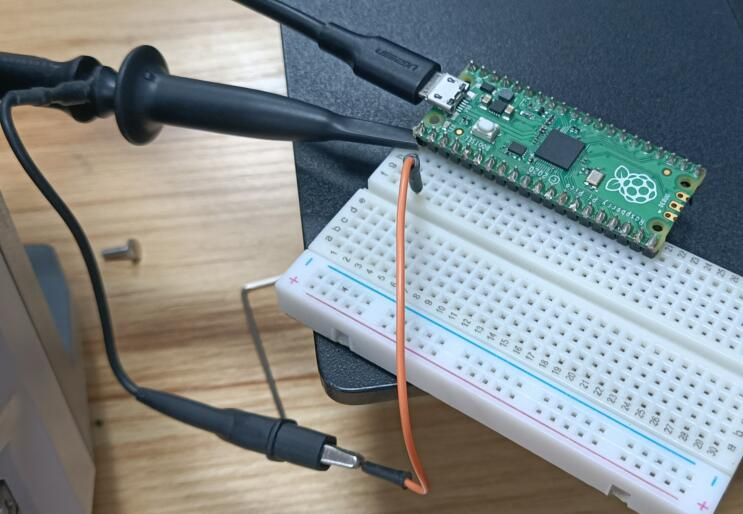
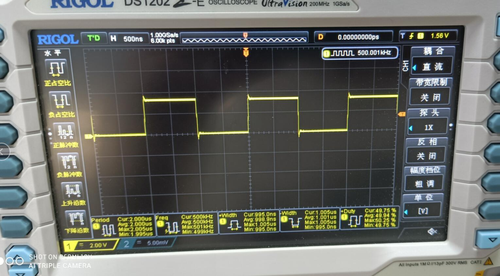
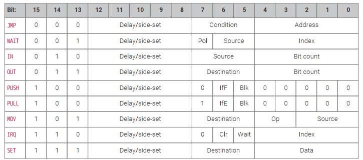
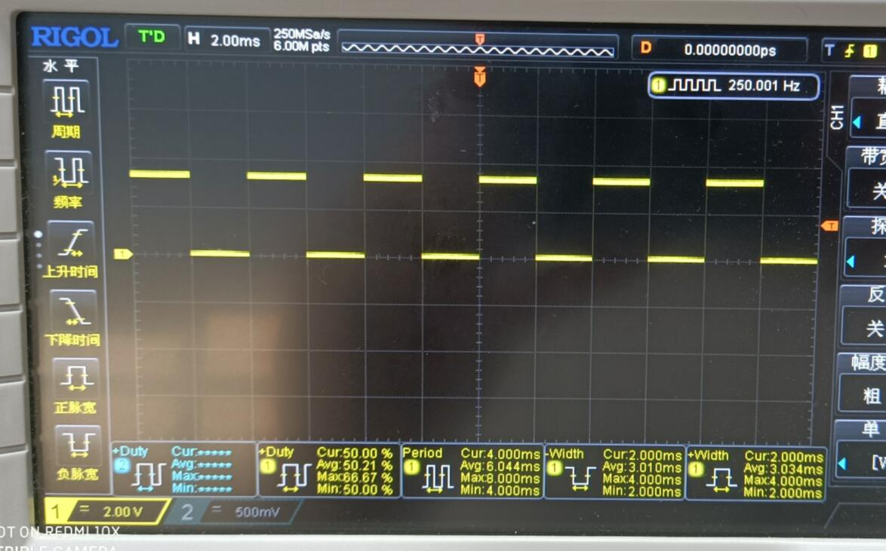
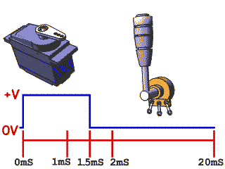

# 通过RP2040的PIO硬件控制多路舵机

[toc]


# 概述

各类MCU往往都带有几个PWM硬件用于输出占空比方波，从而实现简单的模拟电压输出。如Arduino的analogWrite()函数，将模拟值（PWM波）输出到管脚。UNO可以通3，5，6，9，10和11这几个特定的GPIO输出，用于在不同的光线亮度调节发光二极管亮度或以不同的速度驱动马达。

但是如果支持PWM输出的引脚被占用，如UNO D11为SPI的MOSI引脚，那么一般通过软件模拟PWM输出。如通过循环，延时或者中断，将会非常麻烦，并且会占用程序运行时间。如果输出多路模拟PWM信号，会占用大量MCU资源。并且无法模拟频率太高的PWM波，模拟出的频率也不准确。UNO的PWM的信号频率约为490赫兹。

而且对于一些特殊硬件，如舵机的信号要求为20ms周期，普通的PWM硬件无法输出符合要求的信号。用软件模拟代码量也会特别大，尤其是同时控制多路舵机。本文档通过RP2040的PIO硬件，介绍一种较为简单的舵机控制方法。


# PIO原理

The programmable input/output block (PIO) is a versatile hardware interface. It can support a variety of IO standards, including:
  - 8080 and 6800 parallel bus
  - I2C
  - 3-pin I2S
  - SDIO
  - SPI, DSPI, QSPI
  - UART
  - DPI or VGA (via resistor DAC)


There are 2 identical PIO blocks in RP2040. Each PIO block has dedicated connections to the bus fabric, GPIO and interrupt controller. 


PIO is programmable in the same sense as a processor. There are two PIO blocks with four state machines each, that
can independently execute sequential programs to manipulate GPIOs and transfer data. Unlike a general purpose
processor, PIO state machines are highly specialised for IO, with a focus on determinism, precise timing, and close
integration with fixed-function hardware. Each state machine is equipped with:
- Two 32-bit shift registers – either direction, any shift count
- Two 32-bit scratch registers
- 4×32-bit bus FIFO in each direction (TX/RX), reconfigurable as 8×32 in a single direction
- Fractional clock divider (16 integer, 8 fractional bits)
- Flexible GPIO mapping
- DMA interface, sustained throughput up to 1 word per clock from system DMA
- IRQ flag set/clear/status


Each state machine, along with its supporting hardware, occupies approximately the same silicon area as a standard
serial interface block, such as an SPI or I2C controller. However, PIO state machines can be configured and
reconfigured dynamically to implement numerous different interfaces.

Making state machines programmable in a software-like manner, rather than a fully configurable logic fabric like a
CPLD, allows more hardware interfaces to be offered in the same cost and power envelope. This also presents a more
familiar programming model, and simpler tool flow, to those who wish to exploit PIO’s full flexibility by programming it
directly, rather than using a premade interface from the PIO library.

PIO is highly performant as well as flexible, thanks to a carefully selected set of fixed-function hardware inside each
state machine. When outputting DPI, PIO can sustain 360 Mb/s during the active scanline period when running from a
48 MHz system clock. In this example, one state machine is handling frame/scanline timing and generating the pixel
clock, while another is handling the pixel data, and unpacking run-length-encoded scanlines.

State machines' inputs and outputs are mapped to up to 32 GPIOs (limited to 30 GPIOs for RP2040), and all state
machines have independent, simultaneous access to any GPIO. For example, the standard UART code allows TX, RX,
CTS and RTS to be any four arbitrary GPIOs, and I2C permits the same for SDA and SCL. The amount of freedom
available depends on how exactly a given PIO program chooses to use PIO’s pin mapping resources, but at the
minimum, an interface can be freely shifted up or down by some number of GPIOs.


The four state machines execute from a shared instruction memory. System software loads programs into this memory, configures the state machines and IO mapping, and then sets the state machines running. PIO programs come from various sources: 

- Assembled directly by the user
- Drawn from the PIO library
- Generated programmatically by user software.

From this point on, state machines are generally autonomous, and system software interacts through DMA, interrupts and control registers, as with other peripherals on RP2040. For more complex interfaces, PIO provides a small but flexible set of primitives which allow system software to be more hands-on with state machine control flow.


PIO state machines execute short, binary programs. 

Programs for common interfaces, such as UART, SPI, or I2C, are available in the PIO library, so in many cases, it is not necessary to write PIO programs. However, the PIO is much more flexible when programmed directly, supporting a wide variety of interfaces which may not have been foreseen by its designers.

# PIO简单函数

实现一个简单的两路不同频率方波输出。使用Thonny IDE 通过MicroPyhon语言举例。

## PIO 实现方波输出

打开Thonny，新建一个python文件，输入如下代码并执行。

```python
from rp2 import PIO, StateMachine, asm_pio
from machine import Pin
import time


@asm_pio(set_init=PIO.OUT_LOW)
def pwm_1():
    set(pins, 1)
    set(pins, 0)


def test():
    sm1 = StateMachine(1, pwm_1, freq=1000000, set_base=Pin(0))
    sm1.active(1)
    while 1:
        print("Run....")
        time.sleep(5)


test()
```

将示波器的插头连接到GPIO0和GND上 。



可以在示波器上看到GPIO0输出了频率为500000Hz的方波。



### PIO汇编部分

```python
@asm_pio(set_init=PIO.OUT_LOW)
def pwm_1():
    set(pins, 1)
    set(pins, 0)
```

@asm_pio声明这个函数是PIO汇编函数。

set(pins, 1)并不是python函数，而是一条PIO的汇编指令，后面会详细介绍PIO的所有汇编指令。它的作用是将引脚的值设置为高电平（1）或低电平（0）。对于PIO函数中的每一条汇编指令都会占用且只占用一个PIO的指令周期。

整个函数一共只有两条汇编指令，总共两个指令周期。

执行完毕后，PIO硬件会自动从第一条指令循环执行。	


### PIO MicroPython部分

```python
sm1 = StateMachine(1, pwm_1, freq=1000000, set_base=Pin(0))
sm1.active(1)
```

StateMachine是一个状态机对象，需要设置使用的状态机编号，调用的PIO汇编函数，时钟频率和控制的引脚。

RP2040共有2个PIO块,每个块有4个状态机，编号为0-7.

freq设置PIO的时钟频率，设置为1MHz时，每个指令周期为1us。

set_base设置PIO控制的GPIO引脚，这里设置为GPIO0.

sm1.active(1)打开状态机。

结合之前PIO汇编部分的说明，每个指令周期1us，PIO的状态机以2us为周期输出方波。整体的输出频率为500KHz，符合示波器上得到的结果。而且和硬件PWM设备一样，不占用主程序资源，并且频率高度可控，和软件模拟PWM波更为精准。


## PIO实现两路方波输出

打开Thonny，新建一个python文件，输入如下代码并执行。

```python
from rp2 import PIO, StateMachine, asm_pio
from machine import Pin
import time


@asm_pio(set_init=PIO.OUT_LOW)
def pwm_1():
    set(pins, 1)
    set(pins, 0)

@asm_pio(set_init=PIO.OUT_LOW)
def pwm_2():
    set(pins, 1)[2]
    set(pins, 0)[6]


def test():
    sm1 = StateMachine(1, pwm_1, freq=1000000, set_base=Pin(0))
    sm1.active(1)
    sm2 = StateMachine(2, pwm_2, freq=5000000, set_base=Pin(15))
    sm2.active(1)
    while 1:
        print("Run....")
        time.sleep(5)


test()
```

示波器图像显示如下：


可以看出两者周期相同，均为2us。GPIO0输出占空比为50%，GPIO15输出的占空比为30%。

### PIO汇编部分

```python
@asm_pio(set_init=PIO.OUT_LOW)
def pwm_2():
    set(pins, 1)[2]
    set(pins, 0)[6]
```

大部分汇编语言都有一条NOP指令，用于等待一条指令周期做延时用。

在PIO汇编语言为nop()，上面pwm_2中的，set(pins, 1)[2]即为执行完set指令后，延时两个指令周期。等价于如下代码：

```python
@asm_pio(set_init=PIO.OUT_LOW)
def pwm_2():
    set(pins, 1)
    nop()
    nop()
    set(pins, 0)
    nop()
    nop()
    nop()
    nop()
    nop()
    nop()
```

易知整个PIO汇编函数共包含10条指令。

### PIO MicroPython部分

```python
sm2 = StateMachine(2, pwm_2, freq=5000000, set_base=Pin(15))
sm2.active(1)
```

使用了2号状态机，调用了pwm_2函数，并且将频率设置为5MHz。

可计算得出，指令周期为0.2us。

结合汇编部分的代码，容易得出高电平占0.6us，低电平占1.4us，周期为2us。实现了30%占空比，和示波器显示的一样。

# PIO的汇编指令

## PIO指令说明

PIO共有9条指令,分别如下:



### JMP

Set program counter to Address if Condition is true, otherwise no operation.
Delay cycles on a JMP always take effect, whether Condition is true or false, and they take place after Condition is evaluated and the program counter is updated.

Condition:

- 000: (no condition): Always
- 001: !X: scratch X zero
- 010: X--: scratch X non-zero, post-decrement
- 011: !Y: scratch Y zero
- 100: Y--: scratch Y non-zero, post-decrement
- 101: X!=Y: scratch X not equal scratch Y
- 110: PIN: branch on input pin
- 111: !OSRE: output shift register not empty

Address: 

Instruction address to jump to. In the instruction encoding this is an absolute address within the PIO instruction memory.

JMP PIN branches on the GPIO selected by EXECCTRL_JMP_PIN, a configuration field which selects one out of the maximum of 32 GPIO inputs visible to a state machine, independently of the state machine’s other input mapping. The branch is taken if the GPIO is high. !OSRE compares the bits shifted out since the last PULL with the shift count threshold configured by SHIFTCTRL_PULL_THRESH. This is the same threshold used by autopull. JMP X-- and JMP Y-- always decrement scratch register X or Y, respectively. The decrement is not conditional on the current value of the scratch register. The branch is conditioned on the initial value of the register, i.e. before the decrement took place: if the register is initially nonzero, the branch is taken.

### WAIT

Stall until some condition is met. Like all stalling instructions, delay cycles begin after the instruction completes. That is, if any delay cycles are present, they do not begin counting until after the wait condition is met.

Polarity: 

- 1: wait for a 1.
- 0: wait for a 0.

Source: what to wait on. Values are: 

- 00: GPIO: System GPIO input selected by Index. This is an absolute GPIO index, and is not affected by the state machine’s input IO mapping.
- 01: PIN: Input pin selected by Index. This state machine’s input IO mapping is applied first, and then Index selects which of the mapped bits to wait on. In other words, the pin is selected by adding Index to the PINCTRL_IN_BASE configuration, modulo 32. 
- 10: IRQ: PIO IRQ flag selected by Index 
- 11: Reserved

Index: which pin or bit to check.


WAIT x IRQ behaves slightly differently from other WAIT sources:  

- If Polarity is 1, the selected IRQ flag is cleared by the state machine upon the wait condition being met. 
- The flag index is decoded in the same way as the IRQ index field: if the MSB is set, the state machine ID (0…3) is added to the IRQ index, by way of modulo-4 addition on the two LSBs. For example, state machine 2 with a flag value of '0x11' will wait on flag 3, and a flag value of '0x13' will wait on flag 1. This allows multiple state machines running the same program to synchronise with each other.

### IN

Shift Bit count bits from Source into the Input Shift Register (ISR). Shift direction is configured for each state machine by
SHIFTCTRL_IN_SHIFTDIR. Additionally, increase the input shift count by Bit count, saturating at 32.

Source:

- 000: PINS
- 001: X (scratch register X)
- 010: Y (scratch register Y)
- 011: NULL (all zeroes)
- 100: Reserved
- 101: Reserved
- 110: ISR
- 111: OSR

Bit count: How many bits to shift into the ISR. 1…32 bits, 32 is encoded as 00000. 

If automatic push is enabled, IN will also push the ISR contents to the RX FIFO if the push threshold is reached (SHIFTCTRL_PUSH_THRESH). IN still executes in one cycle, whether an automatic push takes place or not. The state machine will stall if the RX FIFO is full when an automatic push occurs. An automatic push clears the ISR contents to all-zeroes, and clears the input shift count.

IN always uses the least significant Bit count bits of the source data. For example, if PINCTRL_IN_BASE is set to 5, the
instruction IN PINS, 3 will take the values of pins 5, 6 and 7, and shift these into the ISR. First the ISR is shifted to the left
or right to make room for the new input data, then the input data is copied into the gap this leaves. The bit order of the
input data is not dependent on the shift direction.

NULL can be used for shifting the ISR’s contents. For example, UARTs receive the LSB first, so must shift to the right.
After 8 IN PINS, 1 instructions, the input serial data will occupy bits 31…24 of the ISR. An IN NULL, 24 instruction will shift
in 24 zero bits, aligning the input data at ISR bits 7…0. Alternatively, the processor or DMA could perform a byte read
from FIFO address + 3, which would take bits 31…24 of the FIFO contents.


### OUT

Shift Bit count bits out of the Output Shift Register (OSR), and write those bits to Destination. Additionally, increase the
output shift count by Bit count, saturating at 32.

Destination:

- 000: PINS
- 001: X (scratch register X)
- 010: Y (scratch register Y)
- 011: NULL (discard data)
- 100: PINDIRS
- 101: PC
- 110: ISR (also sets ISR shift counter to Bit count)
- 111: EXEC (Execute OSR shift data as instruction)

Bit count: how many bits to shift out of the OSR. 1…32 bits, 32 is encoded as 00000.

A 32-bit value is written to Destination: the lower Bit count bits come from the OSR, and the remainder are zeroes. This
value is the least significant Bit count bits of the OSR if SHIFTCTRL_OUT_SHIFTDIR is to the right, otherwise it is the most
significant bits.

PINS and PINDIRS use the OUT pin mapping.

If automatic pull is enabled, the OSR is automatically refilled from the TX FIFO if the pull threshold, SHIFTCTRL_PULL_THRESH,
is reached. The output shift count is simultaneously cleared to 0. In this case, the OUT will stall if the TX FIFO is empty,
but otherwise still executes in one cycle.

OUT EXEC allows instructions to be included inline in the FIFO datastream. The OUT itself executes on one cycle, and the
instruction from the OSR is executed on the next cycle. There are no restrictions on the types of instructions which can
be executed by this mechanism. Delay cycles on the initial OUT are ignored, but the executee may insert delay cycles as normal.

OUT PC behaves as an unconditional jump to an address shifted out from the OSR.

### PUSH

Push the contents of the ISR into the RX FIFO, as a single 32-bit word. Clear ISR to all-zeroes.

- IfFull: If 1, do nothing unless the total input shift count has reached its threshold, SHIFTCTRL_PUSH_THRESH (the same as for autopush).
- Block: If 1, stall execution if RX FIFO is full.

PUSH IFFULL helps to make programs more compact, like autopush. It is useful in cases where the IN would stall at an
inappropriate time if autopush were enabled, e.g. if the state machine is asserting some external control signal at this
point.

The PIO assembler sets the Block bit by default. If the Block bit is not set, the PUSH does not stall on a full RX FIFO, instead
continuing immediately to the next instruction. The FIFO state and contents are unchanged when this happens. The ISR
is still cleared to all-zeroes, and the FDEBUG_RXSTALL flag is set (the same as a blocking PUSH or autopush to a full RX FIFO)
to indicate data was lost.

### PULL

Load a 32-bit word from the TX FIFO into the OSR.

- IfEmpty: If 1, do nothing unless the total output shift count has reached its threshold, SHIFTCTRL_PULL_THRESH (the same as for autopull).
- Block: If 1, stall if TX FIFO is empty. If 0, pulling from an empty FIFO copies scratch X to OSR.

Some peripherals (UART, SPI…) should halt when no data is available, and pick it up as it comes in; others (I2S) should
clock continuously, and it is better to output placeholder or repeated data than to stop clocking. This can be achieved
with the Block parameter.

A nonblocking PULL on an empty FIFO has the same effect as MOV OSR, X. The program can either preload scratch register
X with a suitable default, or execute a MOV X, OSR after each PULL NOBLOCK, so that the last valid FIFO word will be recycled
until new data is available.

PULL IFEMPTY is useful if an OUT with autopull would stall in an inappropriate location when the TX FIFO is empty. For
example, a UART transmitter should not stall immediately after asserting the start bit. IfEmpty permits some of the same
program simplifications as autopull, but the stall occurs at a controlled point in the program.


### MOV

Copy data from Source to Destination.

Destination:

- 000: PINS (Uses same pin mapping as OUT)
- 001: X (Scratch register X)
- 010: Y (Scratch register Y)
- 011: Reserved
- 100: EXEC (Execute data as instruction)
- 101: PC
- 110: ISR (Input shift counter is reset to 0 by this operation, i.e. empty)
- 111: OSR (Output shift counter is reset to 0 by this operation, i.e. full)

Operation:

- 00: None
- 01: Invert (bitwise complement)
- 10: Bit-reverse
- 11: Reserved

Source:

- 000: PINS (Uses same pin mapping as IN)
- 001: X
- 010: Y
- 011: NULL
- 100: Reserved
- 101: STATUS
- 110: ISR
- 111: OSR

MOV PC causes an unconditional jump. MOV EXEC has the same behaviour as OUT EXEC (Section 3.4.5), and allows register
contents to be executed as an instruction. The MOV itself executes in 1 cycle, and the instruction in Source on the next
cycle. Delay cycles on MOV EXEC are ignored, but the executee may insert delay cycles as normal.

The STATUS source has a value of all-ones or all-zeroes, depending on some state machine status such as FIFO full/empty, configured by EXECCTRL_STATUS_SEL.

MOV can manipulate the transferred data in limited ways, specified by the Operation argument. Invert sets each bit in
Destination to the logical NOT of the corresponding bit in Source, i.e. 1 bits become 0 bits, and vice versa. Bit reverse sets
each bit n in Destination to bit 31 - n in Source, assuming the bits are numbered 0 to 31.

### IRQ

Set or clear the IRQ flag selected by Index argument.
Clear: if 1, clear the flag selected by Index, instead of raising it. If Clear is set, the Wait bit has no effect.
Wait: if 1, halt until the raised flag is lowered again, e.g. if a system interrupt handler has acknowledged the flag.
Index:

- The 3 LSBs specify an IRQ index from 0-7. This IRQ flag will be set/cleared depending on the Clear bit.
- If the MSB is set, the state machine ID (0…3) is added to the IRQ index, by way of modulo-4 addition on the two LSBs. For example, state machine 2 with a flag value of 0x11 will raise flag 3, and a flag value of 0x13 will raise flag 1.

IRQ flags 4-7 are visible only to the state machines; IRQ flags 0-3 can be routed out to system level interrupts, on either
of the PIO’s two external interrupt request lines, configured by IRQ0_INTE and IRQ1_INTE.

The modulo addition bit allows relative addressing of 'IRQ' and 'WAIT' instructions, for synchronising state machines
which are running the same program. Bit 2 (the third LSB) is unaffected by this addition.

If Wait is set, Delay cycles do not begin until after the wait period elapses.


### SET

Write immediate value Data to Destination.
Destination:

- 000: PINS
- 001: X (scratch register X) 5 LSBs are set to Data, all others cleared to 0.
- 010: Y (scratch register Y) 5 LSBs are set to Data, all others cleared to 0.
- 011: Reserved
- 100: PINDIRS
- 101: Reserved
- 110: Reserved
- 111: Reserved

Data: 5-bit immediate value to drive to pins or register.

This can be used to assert control signals such as a clock or chip select, or to initialise loop counters. As Data is 5 bits in
size, scratch registers can be SET to values from 0-31, which is sufficient for a 32-iteration loop.

The mapping of SET and OUT onto pins is configured independently. They may be mapped to distinct locations, for
example if one pin is to be used as a clock signal, and another for data. They may also be overlapping ranges of pins: a
UART transmitter might use SET to assert start and stop bits, and OUT instructions to shift out FIFO data to the same pins.

## PIO循环函数例子

由于SET指令赋值的范围仅为0-31，对于一些大数循环不是很方便。

这时我们需要通过用PULL将输入缓存中的数值存储到OSR中，实现PIO汇编代码和主程序的通讯。

打开Thonny，新建一个python文件，输入如下代码并执行。

```python
from rp2 import PIO, StateMachine, asm_pio
from machine import Pin
import time


@asm_pio(set_init=PIO.OUT_LOW)
def pio_pull():
    
    set(pins, 1)
    mov(x,osr)
    
    label("delay_high")
    nop()
    jmp(x_dec, "delay_high")

    set(pins, 0)
    mov(x,osr)
    
    label("delay_low")
    nop()
    jmp(x_dec, "delay_low")

sm = StateMachine(0, pio_pull, freq=100000, set_base=Pin(0))
sm.put(98)
sm.exec("pull()")
sm.active(1)

while 1:
    
    sm.put(98)
    sm.exec("pull()")
    time.sleep(3)
    
    sm.put(198)
    sm.exec("pull()")
    time.sleep(3)

```

可以观察到示波器如下：




GPIO口将每三秒改变一次输出频率，周期分别为2ms和4ms。

### PIO MicroPython部分

```python
sm = StateMachine(0, pio_pull, freq=100000, set_base=Pin(0))
sm.put(98)
sm.exec("pull()")
sm.active(1)

while 1:
    
    sm.put(98)
    sm.exec("pull()")
    time.sleep(3)
    
    sm.put(198)
    sm.exec("pull()")
    time.sleep(3)
```

我们先来说明主程序部分的代码，和之前的代码有区别的是，多出了put()和exec()函数。

StateMachine.put()函数的功能是，把一个数值放入输入缓冲区FIFO中。

StateMachine.exec()函数的功能是，在程序中，调用PIO的汇编函数。在这里我们调用了一个PULL指令。

PULL指令会把FIFO中的值移动到OSR寄存器中。

```python
sm.put(98)
sm.exec("pull()")
time.sleep(3)
```

概括来讲，上面的代码功能是把“98”输入到FIFO中，然后让状态机从缓存器中PULL到OSR寄存器中，睡眠3秒。

### PIO汇编部分

```python
@asm_pio(set_init=PIO.OUT_LOW)
def pio_pull():
    
    set(pins, 1)
    mov(x,osr)
    
    label("delay_high")
    nop()
    jmp(x_dec, "delay_high")

    set(pins, 0)
    mov(x,osr)
    
    label("delay_low")
    nop()
    jmp(x_dec, "delay_low")
```

以上汇编代码分为两个部分，拉高引脚和拉低引脚的部分基本相同。选择拉高的部分分析：

```python
set(pins, 1)
mov(x,osr)
```

通过SET指令开启引脚后，调用MOV指令将OSR中的值，写入X临时寄存器。

通过MicroPython代码部分可知，写入的值分别是98和198.

接下来是一个自减的循环：

```python
label("delay_high")
nop()
jmp(x_dec, "delay_high")
```

LABEL是汇编的入口注释，不占用指令周期，只是作为定位符号使用。可以通过JUMP指令跳转到相应的位置处。

jmp(x_dec, "delay_high")的作用是，如果X寄存器非空，那么X减1并跳转到"delay_high"标签处。

上面的代码相当于这样一个循环：

```python
pin.value(1)
for i in range(0,pull_num):
    time.sleep(delay_time)
pin.value(0)
for i in range(0,pull_num):
    time.sleep(delay_time)
```

实现了通过主程序和PIO状态机通讯，控制输出方波的周期。

# PIO 舵机驱动

## 舵机的驱动原理

控制线用于传输角度控制信号。这个角度是由控制信号脉冲的持续时间决定的，这叫做脉冲编码调制（PCM）。

舵机的控制一般需要一个20ms左右的时基脉冲，该脉冲的高电平部分一般为0.5ms-2.5ms范围，总间隔为2ms。脉冲的宽度将决定马达转动的距离。例如：1.5毫秒的脉冲，电机将转向90度的位置（通常称为中立位置，对于180°舵机来说，就是90°位置）。如果脉冲宽度小于1.5毫秒，那么电机轴向朝向0度方向。



## 舵机驱动完整实现

```from rp2 import PIO, StateMachine, asm_pio
from machine import Pin
import time

T_X = 4000
T_Y0 = 3900
T_Y180 = 3500


#freq=800000 0.5ms y=3900 2.5ms y=3500 unit_y:2.5us == 0.45degree
@asm_pio(set_init=PIO.OUT_LOW)
def servo_ctrl2():

    mov(x, isr)
    set(pins, 1)
    
    label("for")
    jmp(not_x,"over")
    jmp(x_not_y,"dec")
    set(pins, 0)
    label("dec")
    jmp(x_dec,"continue")
    label("continue")
    jmp("for")

    label("over")
    nop()[3]


class PIO_SERVO:
    def __init__(self, sm_id, pin):
        self._sm = StateMachine(
            sm_id, servo_ctrl2, freq=800000, set_base=Pin(pin))
        # Use exec() to load max count into ISR
        #self._sm.put(T_Y0)
        self._sm.put(T_X)
        self._sm.exec("pull()")
        self._sm.exec("mov(y, osr)")
        self._sm.put(T_X)
        self._sm.exec("pull()")
        self._sm.exec("mov(isr, osr)")
        self._sm.active(1)

    def set(self, pio_cycle):
        self._sm.active(0)
        self._sm.put(pio_cycle)
        self._sm.exec("pull()")
        self._sm.exec("mov(y, osr)")
        self._sm.put(T_X)
        self._sm.exec("pull()")
        self._sm.exec("mov(isr, osr)")
        self._sm.active(1)

    def set_ms(self, ms):
        if ms < 0.5:
            ms = 0.5
        elif ms > 2.5:
            ms = 2.5

        pio_cycle = int(3900 - (ms - 0.5) * 200)
        self.set(pio_cycle)
    
    def set_angle(self, angle):
        ms = (angle + 90.0) / 90.0 + 0.5
        self.set_ms(ms)


def test():

    servo = PIO_SERVO(0, 16)
    # servo.set(180)
    # servo.set_ms(1.5)
    while 0:
        time.sleep(3)
    while 1:

        # servo.set(T_Y180)
        servo.set_ms(0.5)

        time.sleep(3)

        # servo.set(T_Y0)
        servo.set_ms(2.5)

        time.sleep(3)


#test()
```

### PIO 汇编部分

```python
#freq=800000 0.5ms y=3900 2.5ms y=3500 unit_y:2.5us == 0.45degree
@asm_pio(set_init=PIO.OUT_LOW)
def servo_ctrl2():

    mov(x, isr)
    set(pins, 1)
    
    label("for")
    jmp(not_x,"over")
    jmp(x_not_y,"dec")
    set(pins, 0)
    label("dec")
    jmp(x_dec,"continue")
    label("continue")
    jmp("for")

    label("over")
    nop()[3]
```

汇编部分的逻辑如下：

- 将循环周期从ISR写入X寄存器中
- 拉高GPIO引脚
- 进入”for“循环
- 检测X与Y是否相等，当X递减到Y的时候，拉低GPIO引脚结束高电平时间
- 进行X自减运算
- 当X非空时持续循环
- 循环结束用几个空指令补足20ms周期。

总共用到了三个寄存器，ISR，X，Y三个寄存器。

### PIO MicroPython部分

```python
T_X = 4000
T_Y0 = 3900
T_Y180 = 3500

class PIO_SERVO:
    def __init__(self, sm_id, pin):
        self._sm = StateMachine(
            sm_id, servo_ctrl2, freq=800000, set_base=Pin(pin))
        # Use exec() to load max count into ISR
        #self._sm.put(T_Y0)
        self._sm.put(T_X)
        self._sm.exec("pull()")
        self._sm.exec("mov(y, osr)")
        self._sm.put(T_X)
        self._sm.exec("pull()")
        self._sm.exec("mov(isr, osr)")
        self._sm.active(1)
        
	def set(self, pio_cycle):
        self._sm.active(0)
        self._sm.put(pio_cycle)
        self._sm.exec("pull()")
        self._sm.exec("mov(y, osr)")
        self._sm.put(T_X)
        self._sm.exec("pull()")
        self._sm.exec("mov(isr, osr)")
        self._sm.active(1)
```

设置状态机频率为800KHz，指令周期为1.25us。

初始化部分先将数值装入缓冲区，通过PULL指令获取到OSR，然后再从OSR中MOV到各个寄存器。

由于临时寄存器XY不够用，并且不需要输出任何数据，就把循环总数装入ISR中。

### 多路舵机控制

RP2040有两个PIO设备共8个状态机，编号为：0-7。

只要保证状态机编号不同便可控制多个舵机，PIO汇编函数可以复用。

下面实现了一个完整的基于PIO控制实现的六轴机械臂控制代码，分为舵机层，机械臂单轴，机械臂，机械臂控制三个等级。总共使用了六个舵机，同时启用了PIO的六个状态机进行同步控制。


#### PIO舵机驱动

包含了基于PIO的舵机驱动，声明了一个舵机类，并提供了基于时序和角度控制的方法。

```python
#arm6\pio_servo.py

from rp2 import PIO, StateMachine, asm_pio
from machine import Pin
import time

T_X = 4000
T_Y0 = 3900
T_Y180 = 3500


#freq=800000 0.5ms y=3900 2.5ms y=3500 unit_y:2.5us == 0.45degree
@asm_pio(set_init=PIO.OUT_LOW)
def servo_ctrl2():

    mov(x, isr)
    set(pins, 1)
    
    label("for")
    jmp(not_x,"over")
    jmp(x_not_y,"dec")
    set(pins, 0)
    label("dec")
    jmp(x_dec,"continue")
    label("continue")
    jmp("for")

    label("over")
    nop()[3]


class PIO_SERVO:
    def __init__(self, sm_id, pin):
        self._sm = StateMachine(
            sm_id, servo_ctrl2, freq=800000, set_base=Pin(pin))
        # Use exec() to load max count into ISR
        #self._sm.put(T_Y0)
        self._sm.put(T_X)
        self._sm.exec("pull()")
        self._sm.exec("mov(y, osr)")
        self._sm.put(T_X)
        self._sm.exec("pull()")
        self._sm.exec("mov(isr, osr)")
        self._sm.active(1)

    def set(self, pio_cycle):
        self._sm.active(0)
        self._sm.put(pio_cycle)
        self._sm.exec("pull()")
        self._sm.exec("mov(y, osr)")
        self._sm.put(T_X)
        self._sm.exec("pull()")
        self._sm.exec("mov(isr, osr)")
        self._sm.active(1)

    def set_ms(self, ms):
        if ms < 0.5:
            ms = 0.5
        elif ms > 2.5:
            ms = 2.5

        pio_cycle = int(3900 - (ms - 0.5) * 200)
        self.set(pio_cycle)
    
    def set_angle(self, angle):
        ms = (angle + 90.0) / 90.0 + 0.5
        self.set_ms(ms)


```


#### 机械臂抽象层

声明了机械臂单轴对象，每个轴包含了一个舵机。将六个轴打包为一个舵机，提供了一系列初始化，刷新机械臂姿态等控制方法。

```python
#arm6\arm_6axis.py

from pio_servo import PIO_SERVO
import time

# PIN_LIST = [0, 1, 2, 3, 4, 5]
# DIR_LIST = [0, 0, 0, 1, 0, 0]


class Arm_axis:
    def __init__(self, index, pin, direct):
        self.id = index
        self.pin = pin
        self.dir = direct
        # default position is middle
        self.angle = 0.0
        self.servo = PIO_SERVO(self.id, self.pin)

    def set_angle(self, angle):
        if angle < -90.0:
            angle = -90.0
        elif angle > 90.0:
            angle = 90.0
        self.angle = angle

    def fresh(self):
        real_angle = self.angle
        if self.dir == 1:
            real_angle = -real_angle
        self.servo.set_angle(real_angle)

    def angle_report(self):
        return self.angle


class Arm_6:
    def __init__(self, pin_list, dir_list):
        self.axises = []
        for i in range(6):
            self.axises.append(
                Arm_axis(i, pin_list[i], dir_list[i]))

    def flesh_single(self, index):
        self.axises[index].fresh()

    def flesh(self):
        for i in range(6):
            self.axises[i].fresh()

    def set_single_angle(self, index, angle):
        self.axises[index].set_angle(angle)

    def pos_report(self):
        pos = []
        for i in range(6):
            pos.append(self.axises[i].angle_report())

        return pos


```

#### 机械臂指令解析

提供了一套控制命令，包含了绝对角度和相对角度两种运动方式，以及按键，蜂鸣器，延时等命令。可通过类似Gcode的方式来批量从文件中读取控制指令。

```python
#arm6\arm_controller.py

from arm_6axis import Arm_6
import time

RUNFILE = "arm_code2.txt"
DEBUG = 0

PIN_LIST    = [16, 17, 18, 19, 20, 21]
DIR_LIST    = [0, 1, 1, 0, 0, 1]
ANGLE_LIST  = [-2, -40, 75, 75, 0, -10]


DELAY_TIME = 0.5


class Arm_controller:
    def __init__(self, PIN_LIST, DIR_LIST):
        self.arm = Arm_6(PIN_LIST, DIR_LIST)

    def explain_line(self, TEXT):
        if TEXT[0] == "#":
            if DEBUG:
                print(TEXT)
            return 0

        elif TEXT.find("ABS") == 0:
            command_list = TEXT[4:].split(" ")
            if DEBUG:
                print("ABS")
                print(command_list)
            self.explain_absolate(command_list)
            return 1

        elif TEXT.find("REL") == 0:
            command_list = TEXT[4:].split(" ")
            if DEBUG:
                print("REL")
                print(command_list)
            self.explain_relative(command_list)
            return 1

        elif TEXT.find("END") == 0:
            print("COMMAND END")
            print("Finally POS:")
            print(self.arm.pos_report())
            return 2

        elif TEXT.find("POS") == 0:
            self.arm.flesh()
            time.sleep(2)
            print("REALLY POS:")
            print(self.arm.pos_report())
            return 1

        elif TEXT.find("WAIT") == 0:
            time.sleep(2)
            return 1

        elif TEXT.find("SLEEP") == 0:
            sleep_time = int(TEXT[6:])
            print("Sleep " + str(sleep_time) + "...")
            time.sleep(sleep_time)
            return 1

        elif TEXT.find("BUZZ") == 0:
            alarm()
            return 1
        
        elif TEXT.find("BUTT") == 0:
            input_button()
            return 1

        else:
            print("WARNING : NOT KNOWN COMMAND")
            print(TEXT)
            return -1

    def explain_absolate(self, COMMAND_LIST):
        for part in COMMAND_LIST:
            index = self.get_index(part[0])
            angle = int(part[1:])

            # print(index)
            # print(angle)

            self.arm.set_single_angle(index, angle)
        self.arm.flesh()
        time.sleep(DELAY_TIME)

    def explain_relative(self, COMMAND_LIST):
        pos_list = self.arm.pos_report()
        for part in COMMAND_LIST:
            index = self.get_index(part[0])
            angle = int(part[1:]) + pos_list[index]

            # print(index)
            # print(angle)

            self.arm.set_single_angle(index, angle)
        self.arm.flesh()
        time.sleep(DELAY_TIME)

    # init by angle list
    def init_arm_angle(self, ANGLE_LIST):
        for index in range(6):
            self.arm.set_single_angle(index, ANGLE_LIST[index])
        self.arm.flesh()
        time.sleep(2)

    def get_index(self, part):
        axis_dic = {'A': 0, 'B': 1, 'C': 2, 'D': 3, 'E': 4, 'F': 5}
        return axis_dic[part]


def control_by_file():

    ct = Arm_controller(PIN_LIST, DIR_LIST)
    ct.init_arm_angle(ANGLE_LIST)

    file = open(RUNFILE, "r")

    for line in file:
        print(line)
        if line.isspace():
            continue
        if ct.explain_line(line) == 2:
            break
    file.close()


def control_by_serial():
    ct = Arm_controller(PIN_LIST, DIR_LIST)
    ct.init_arm_angle(ANGLE_LIST)
    line = ""
    while 1:
        line = input()
        if line.isspace():
            continue
        if ct.explain_line(line) == 2:
            break
        line = ""


def control_by_serial_save():
    file = open("Log.txt", "w")
    file.write("#" + str(PIN_LIST) + "\n")
    file.write("#" + str(DIR_LIST) + "\n")
    file.write("#" + str(ANGLE_LIST) + "\n")

    ct = Arm_controller(PIN_LIST, DIR_LIST)
    ct.init_arm_angle(ANGLE_LIST)
    line = ""
    while 1:
        line = input()
        file.write(str(line) + "\n")
        if line.isspace():
            continue
        if ct.explain_line(line) == 2:
            break
        line = ""

    file.close()

def alarm():
    buzzer = machine.Pin(15, machine.Pin.OUT)
    for i in range(500):
        buzzer.value(1)
        time.sleep(0.001)
        buzzer.value(0)
        time.sleep(0.001)

def input_button():
    button = machine.Pin(14, machine.Pin.IN, machine.Pin.PULL_UP)
    print("Wait button press")
    while 1:
        if button.value() == 0:
            time.sleep(0.5)
            if button.value() == 0:
                alarm()
                break
        time.sleep(0.5)    
def test():

    while 1:
        control_by_file()
        break
    # control_by_serial()
    # control_by_serial_save()

test()
```

#### 简单控制案例

下面是用机械臂移动汉诺塔的部分代码。

- ABS 绝对角度控制
- REL 相对角度控制
- WAIT 延时
- #注释符号
- POS回传实时绝对坐标
- BUTT 按键等待
- BUZZ 蜂鸣器工作
- SLEEP 休眠指定时间

```txt
#[16, 17, 18, 19, 20, 21]
#[0, 1, 1, 0, 0, 1]
#[-2, -25, 75, 75, 0, -10]

#圆盘机械臂 F-10张开，F35夹紧
#哈诺塔高度C75 D62, B = 3：5 2：9 1：14
# 	 3		 3		 3
#	 2		 2		 2
#	 1  	 1 		 1
#	[1]		[2]		[3]

#顺序
#1:3 -> 3:1
#1:2 -> 2:1
#3:1 -> 2:2
#1:1 -> 3:1
#2:2 -> 1:1
#2:1 -> 3:2
#1:1 -> 3:3

###############################1:3 -> 3:1
#定位1：3
ABS A18 B-20 C75 D62 F-10
WAIT

#下降
ABS B5
WAIT

#夹起
ABS F30

# POS
# [18, 5, 75, 62, 0, 30]

#抬起
REL B-6
WAIT

#移动A-18
ABS A-18
WAIT

#移动到3：1
REL B3
REL B3
REL B3
REL B3
REL B3

#松开
ABS F-10

# POS
# [-18, 14, 75, 62, 0, -10]

#返回悬空
ABS B0
```


# 备注

更多PIO相关内容请参考官方文档：

[raspberry-pi-pico-python-sdk](https://datasheets.raspberrypi.org/pico/raspberry-pi-pico-python-sdk.pdf)

[rp2040-datasheet](https://datasheets.raspberrypi.org/rp2040/rp2040-datasheet.pdf)

[raspberry-pi-pico-c-sdk](https://datasheets.raspberrypi.org/pico/raspberry-pi-pico-c-sdk.pdf)

