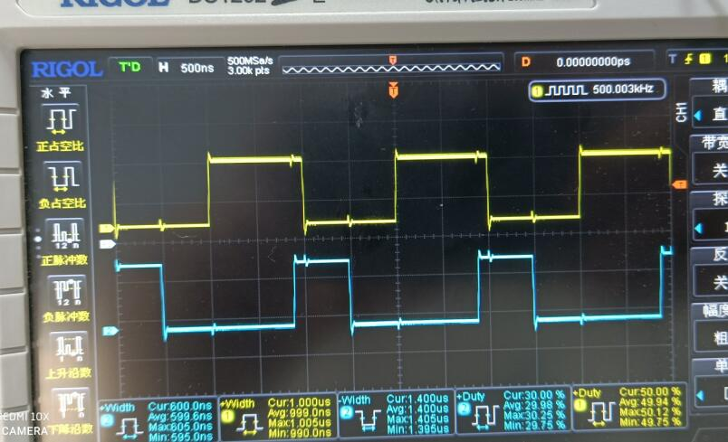

# PICO Merchanical Hand Driver

```c
/*
Version:		V2.0
Author:			Vincent
Create Date:	2021/7/21
Note:
			2021/7/23 V2.0:Add PIO document.
*/
```


[toc]

# Makerfabs

[Makerfabs home page](https://www.makerfabs.com/)

[Makerfabs Wiki](https://wiki.makerfabs.com/)

# PICO Merchanical Hand Driver

## Introduce

Pico mechanical hand driver is a platform based on raspberry pi pico, which is designed for driving and controlling servos. The board comes with an 8-bit level translator and 8 channels GPIO headers that can connect the servo directly. Now you can build your new project about servo by trying out the Raspberry PI Pico.

### Wiki Link:[PICO_Servo_Driver](https://wiki.makerfabs.com/PICO_Servo_Driver.html)


# Feature

- Standard Raspberry Pi Pico header.
- Onboard 8-bit level translator TXB0108PWR for driving servos.
- 8-channel expansion GPIOs for servos.
- Onboard Active buzzer.
- One button.
- Power supply: 5V.

### Front:


# Control multiple Servos with RP2040 PIO

[toc]


# Overview

Most of the MCU have some kind of PWM outputs,  for example the analogWrite() in Arduino, it output PWM to related pins, with UNO, these pins can be 3/5/6/9/10 and 11, to control the connected LED brightness , or motor speed. 

But if these hardware pins already used by some other functions, such as the D11 in UNO(MOSI in SPI communication), most users simulate the PWM in firmware, which need hardware times/interrupts, which take big burden to the MCU. and seriously, when the PWM frequency get high, or multiple PWM are needed, the frequency get unstable, as the MCU maybe too busy to deal with them all, on time. 

And more, for  servo control, it may needs signal with 20ms frequency, with 0.1%~99.9% logic high duty, hardware PWM can not output such a signal, while with firmware simulating, it will take a lot of timer/interrupt and MCU ability, especially when it comes to multiple servo simultaneously.   Here we introduce a simple way , based on the hardware PIO in RP2040(Raspberry Pi PICO), to control multiple servo without the MCU engaging in much. 


# PIO

The programmable input/output block (PIO) is a versatile hardware interface. It can support a variety of IO standards, including:
  - 8080 and 6800 parallel bus
  - I2C
  - 3-pin I2S
  - SDIO
  - SPI, DSPI, QSPI
  - UART
  - DPI or VGA (via resistor DAC)


There are 2 identical PIO blocks in RP2040. Each PIO block has dedicated connections to the bus fabric, GPIO and interrupt controller. 


PIO is programmable in the same sense as a processor. There are two PIO blocks with four state machines each, that can independently execute sequential programs to manipulate GPIOs and transfer data. Unlike a general purpose processor, PIO state machines are highly specialised for IO, with a focus on determinism, precise timing, and close integration with fixed-function hardware. Each state machine is equipped with:
- Two 32-bit shift registers – either direction, any shift count
- Two 32-bit scratch registers
- 4×32-bit bus FIFO in each direction (TX/RX), reconfigurable as 8×32 in a single direction
- Fractional clock divider (16 integer, 8 fractional bits)
- Flexible GPIO mapping
- DMA interface, sustained throughput up to 1 word per clock from system DMA
- IRQ flag set/clear/status


Each state machine, along with its supporting hardware, occupies approximately the same silicon area as a standard serial interface block, such as an SPI or I2C controller. However, PIO state machines can be configured and reconfigured dynamically to implement numerous different interfaces.

Making state machines programmable in a software-like manner allows more hardware interfaces to be offered in the same cost and power envelope and also presents a more familiar programming model, and simpler tool flow, to those who wish to exploit PIO’s full flexibility by programming it directly, rather than using a premade interface from the PIO library.

State machines' inputs and outputs are mapped to up to 32 GPIOs (limited to 30 GPIOs for RP2040), and all state machines have independent, simultaneous access to any GPIO. For example, the standard UART code allows TX, RX, CTS and RTS to be any four arbitrary GPIOs, and I2C permits the same for SDA and SCL. The amount of freedom available depends on how exactly a given PIO program chooses to use PIO’s pin mapping resources, but at the minimum, an interface can be freely shifted up or down by some number of GPIOs.

The four state machines execute from a shared instruction memory. System software loads programs into this memory, configures the state machines and IO mapping, and then sets the state machines running. PIO programs come from various sources: 

- Assembled directly by the user
- Drawn from the PIO library
- Generated programmatically by user software.

From this point on, state machines are generally autonomous, and system software interacts through DMA, interrupts and control registers, as with other peripherals on RP2040. For more complex interfaces, PIO provides a small but flexible set of primitives which allow system software to be more hands-on with state machine control flow.


PIO state machines execute short, binary programs. 

Programs for common interfaces, such as UART, SPI, or I2C, are available in the PIO library, so in many cases, it is not necessary to write PIO programs. However, the PIO is much more flexible when programmed directly, supporting a wide variety of interfaces which may not have been foreseen by its designers.

# Basic usage with PIO RP2040

Output 2 PWM with diff frequency, with Thonny IDE  MicroPyhon

Full code is in : [PICO_Merchanical_Hand_Driver](https://github.com/Makerfabs/PICO_Merchanical_Hand_Driver)/**Arm6axis**/

## Outputs PWM with PIO

Open Thonny， Create a new Python file, inputs the follows code and excute:

```python
from rp2 import PIO, StateMachine, asm_pio
from machine import Pin
import time


@asm_pio(set_init=PIO.OUT_LOW)
def pwm_1():
    set(pins, 1)
    set(pins, 0)


def test():
    sm1 = StateMachine(1, pwm_1, freq=1000000, set_base=Pin(0))
    sm1.active(1)
    while 1:
        print("Run....")
        time.sleep(5)


test()
```

Test the GPIO0 with Oscilloscope:


PWM with frequency 500K Hz:


### Assembly Parts

```python
@asm_pio(set_init=PIO.OUT_LOW)
def pwm_1():
    set(pins, 1)
    set(pins, 0)
```

@asm_pio defines this function a PIO assembly function

set(pins, 1) is not a python funtion, but a PIO assembly function(we will explain it some later,together with other PIO assembly functions)，it sets the logitic 1 and 0. each PIO assebly function take 1 PIO cycle, so there 2 assembly funtions here , wit 2 PIO cycles. 

​	

### MicroPython Parts

```python
sm1 = StateMachine(1, pwm_1, freq=1000000, set_base=Pin(0))
sm1.active(1)
```

initiate a state machine object , and set the machine state code, assembly function, frequency and the related pins.  There totally 2 PIO in RP2040, and 4 state machine each, so the machine state code 0~7

freq sets the PIO frequency,1MHz，so the cycle 1us。

set_base  sets PIO GPIO to 0

sm1.active(1) to open the state machine.


The PIO outputs PWM with 2 us cycle(500 KHz), as the Oscilloscope, the advantagtes are:

a. Much precisly  than simulation with software

b. Easy to change the frequency 

c. Do not take hardware ablity , timers/ interrupts/ MCU.


## Output 2 PWM with PIO

Open Thonny， Create a new Python file, inputs the follows code and excute:

```python
from rp2 import PIO, StateMachine, asm_pio
from machine import Pin
import time


@asm_pio(set_init=PIO.OUT_LOW)
def pwm_1():
    set(pins, 1)
    set(pins, 0)

@asm_pio(set_init=PIO.OUT_LOW)
def pwm_2():
    set(pins, 1)[2]
    set(pins, 0)[6]


def test():
    sm1 = StateMachine(1, pwm_1, freq=1000000, set_base=Pin(0))
    sm1.active(1)
    sm2 = StateMachine(2, pwm_2, freq=5000000, set_base=Pin(15))
    sm2.active(1)
    while 1:
        print("Run....")
        time.sleep(5)


test()
```

The outputs:




2 PWM with same frequency, GPIO1 duty 50% and GPIO15 duty 30%

### Assembly Parts

```python
@asm_pio(set_init=PIO.OUT_LOW)
def pwm_2():
    set(pins, 1)[2]
    set(pins, 0)[6]
```

In the set(pins, 1)[2], it means 2 cycle delays after the commaand set, equivalent to NOP:

```python
@asm_pio(set_init=PIO.OUT_LOW)
def pwm_2():
    set(pins, 1)
    nop()
    nop()
    set(pins, 0)
    nop()
    nop()
    nop()
    nop()
    nop()
    nop()
```

10 commands totally.

### PIO MicroPython

```python
sm2 = StateMachine(2, pwm_2, freq=5000000, set_base=Pin(15))
sm2.active(1)
```

Here the state machine #2 was used, and frequency set to 5MHz. As simple caculation, the logic 10.6us, logic 0 1.4us, that is , PWM with 2 us cyle, 30% duty, same as the outputs from the oscilloscope.

# PIO assembly commands

## PIO assembly commands

There 9 commands in PIO:


### JMP

Set program counter to Address if Condition is true, otherwise no operation.

Condition:

- 000: (no condition): Always
- 001: !X: scratch X zero
- 010: X--: scratch X non-zero, post-decrement
- 011: !Y: scratch Y zero
- 100: Y--: scratch Y non-zero, post-decrement
- 101: X!=Y: scratch X not equal scratch Y
- 110: PIN: branch on input pin
- 111: !OSRE: output shift register not empty

### WAIT

Stall until some condition is met.

Polarity: 

- 1: wait for a 1.
- 0: wait for a 0.

Source: what to wait on. Values are: 

- 00: GPIO: System GPIO input selected by Index. This is an absolute GPIO index, and is not affected by the state machine’s input IO mapping.
- 01: PIN: Input pin selected by Index. This state machine’s input IO mapping is applied first, and then Index selects which of the mapped bits to wait on. In other words, the pin is selected by adding Index to the PINCTRL_IN_BASE configuration, modulo 32. 
- 10: IRQ: PIO IRQ flag selected by Index 
- 11: Reserved

Index: which pin or bit to check.


### IN

Shift Bit count bits from Source into the Input Shift Register (ISR). Shift direction is configured for each state machine by
SHIFTCTRL_IN_SHIFTDIR. Additionally, increase the input shift count by Bit count, saturating at 32.

Source:

- 000: PINS
- 001: X (scratch register X)
- 010: Y (scratch register Y)
- 011: NULL (all zeroes)
- 100: Reserved
- 101: Reserved
- 110: ISR
- 111: OSR

Bit count: How many bits to shift into the ISR. 1…32 bits, 32 is encoded as 00000. 

If automatic push is enabled, IN will also push the ISR contents to the RX FIFO if the push threshold is reached (SHIFTCTRL_PUSH_THRESH). IN still executes in one cycle, whether an automatic push takes place or not. The state machine will stall if the RX FIFO is full when an automatic push occurs. An automatic push clears the ISR contents to all-zeroes, and clears the input shift count.

IN always uses the least significant Bit count bits of the source data. For example, if PINCTRL_IN_BASE is set to 5, the instruction IN PINS, 3 will take the values of pins 5, 6 and 7, and shift these into the ISR. First the ISR is shifted to the left or right to make room for the new input data, then the input data is copied into the gap this leaves. The bit order of the input data is not dependent on the shift direction.

NULL can be used for shifting the ISR’s contents. For example, UARTs receive the LSB first, so must shift to the right.
After 8 IN PINS, 1 instructions, the input serial data will occupy bits 31…24 of the ISR. An IN NULL, 24 instruction will shift in 24 zero bits, aligning the input data at ISR bits 7…0. Alternatively, the processor or DMA could perform a byte read from FIFO address + 3, which would take bits 31…24 of the FIFO contents.


### OUT

Shift Bit count bits out of the Output Shift Register (OSR), and write those bits to Destination. Additionally, increase the output shift count by Bit count, saturating at 32.

Destination:

- 000: PINS
- 001: X (scratch register X)
- 010: Y (scratch register Y)
- 011: NULL (discard data)
- 100: PINDIRS
- 101: PC
- 110: ISR (also sets ISR shift counter to Bit count)
- 111: EXEC (Execute OSR shift data as instruction)

Bit count: how many bits to shift out of the OSR. 1…32 bits, 32 is encoded as 00000.

A 32-bit value is written to Destination: the lower Bit count bits come from the OSR, and the remainder are zeroes. This value is the least significant Bit count bits of the OSR if SHIFTCTRL_OUT_SHIFTDIR is to the right, otherwise it is the most
significant bits.

PINS and PINDIRS use the OUT pin mapping.

If automatic pull is enabled, the OSR is automatically refilled from the TX FIFO if the pull threshold, SHIFTCTRL_PULL_THRESH, is reached. The output shift count is simultaneously cleared to 0. In this case, the OUT will stall if the TX FIFO is empty, but otherwise still executes in one cycle.

OUT EXEC allows instructions to be included inline in the FIFO datastream. The OUT itself executes on one cycle, and the instruction from the OSR is executed on the next cycle. There are no restrictions on the types of instructions which can be executed by this mechanism. Delay cycles on the initial OUT are ignored, but the executee may insert delay cycles as normal.

OUT PC behaves as an unconditional jump to an address shifted out from the OSR.

### PUSH

Push the contents of the ISR into the RX FIFO, as a single 32-bit word. Clear ISR to all-zeroes.

- If Full: If 1, do nothing unless the total input shift count has reached its threshold, SHIFTCTRL_PUSH_THRESH (the same as for autopush).
- Block: If 1, stall execution if RX FIFO is full.

PUSH IFFULL helps to make programs more compact, like autopush. It is useful in cases where the IN would stall at an
inappropriate time if autopush were enabled, e.g. if the state machine is asserting some external control signal at this
point.

The PIO assembler sets the Block bit by default. If the Block bit is not set, the PUSH does not stall on a full RX FIFO, instead
continuing immediately to the next instruction. The FIFO state and contents are unchanged when this happens. The ISR
is still cleared to all-zeroes, and the FDEBUG_RXSTALL flag is set (the same as a blocking PUSH or autopush to a full RX FIFO)
to indicate data was lost.

### PULL

Load a 32-bit word from the TX FIFO into the OSR.

- IfEmpty: If 1, do nothing unless the total output shift count has reached its threshold, SHIFTCTRL_PULL_THRESH (the same as for autopull).
- Block: If 1, stall if TX FIFO is empty. If 0, pulling from an empty FIFO copies scratch X to OSR.

Some peripherals (UART, SPI…) should halt when no data is available, and pick it up as it comes in; others (I2S) should
clock continuously, and it is better to output placeholder or repeated data than to stop clocking. This can be achieved
with the Block parameter.

A nonblocking PULL on an empty FIFO has the same effect as MOV OSR, X. The program can either preload scratch register
X with a suitable default, or execute a MOV X, OSR after each PULL NOBLOCK, so that the last valid FIFO word will be recycled
until new data is available.

PULL IFEMPTY is useful if an OUT with autopull would stall in an inappropriate location when the TX FIFO is empty. For
example, a UART transmitter should not stall immediately after asserting the start bit. IfEmpty permits some of the same
program simplifications as autopull, but the stall occurs at a controlled point in the program.


### MOV

Copy data from Source to Destination.

Destination:

- 000: PINS (Uses same pin mapping as OUT)
- 001: X (Scratch register X)
- 010: Y (Scratch register Y)
- 011: Reserved
- 100: EXEC (Execute data as instruction)
- 101: PC
- 110: ISR (Input shift counter is reset to 0 by this operation, i.e. empty)
- 111: OSR (Output shift counter is reset to 0 by this operation, i.e. full)

Operation:

- 00: None
- 01: Invert (bitwise complement)
- 10: Bit-reverse
- 11: Reserved

Source:

- 000: PINS (Uses same pin mapping as IN)
- 001: X
- 010: Y
- 011: NULL
- 100: Reserved
- 101: STATUS
- 110: ISR
- 111: OSR

MOV PC causes an unconditional jump. MOV EXEC has the same behaviour as OUT EXEC (Section 3.4.5), and allows register contents to be executed as an instruction. The MOV itself executes in 1 cycle, and the instruction in Source on the next cycle. Delay cycles on MOV EXEC are ignored, but the executee may insert delay cycles as normal.

The STATUS source has a value of all-ones or all-zeroes, depending on some state machine status such as FIFO full/empty, configured by EXECCTRL_STATUS_SEL.

MOV can manipulate the transferred data in limited ways, specified by the Operation argument. Invert sets each bit in Destination to the logical NOT of the corresponding bit in Source, i.e. 1 bits become 0 bits, and vice versa. Bit reverse sets each bit n in Destination to bit 31 - n in Source, assuming the bits are numbered 0 to 31.

### IRQ

Set or clear the IRQ flag selected by Index argument.
Clear: if 1, clear the flag selected by Index, instead of raising it. If Clear is set, the Wait bit has no effect.
Wait: if 1, halt until the raised flag is lowered again, e.g. if a system interrupt handler has acknowledged the flag.
Index:

- The 3 LSBs specify an IRQ index from 0-7. This IRQ flag will be set/cleared depending on the Clear bit.
- If the MSB is set, the state machine ID (0…3) is added to the IRQ index, by way of modulo-4 addition on the two LSBs. For example, state machine 2 with a flag value of 0x11 will raise flag 3, and a flag value of 0x13 will raise flag 1.

IRQ flags 4-7 are visible only to the state machines; IRQ flags 0-3 can be routed out to system level interrupts, on either
of the PIO’s two external interrupt request lines, configured by IRQ0_INTE and IRQ1_INTE.

The modulo addition bit allows relative addressing of 'IRQ' and 'WAIT' instructions, for synchronising state machines
which are running the same program. Bit 2 (the third LSB) is unaffected by this addition.

If Wait is set, Delay cycles do not begin until after the wait period elapses.


### SET

Write immediate value Data to Destination.
Destination:

- 000: PINS
- 001: X (scratch register X) 5 LSBs are set to Data, all others cleared to 0.
- 010: Y (scratch register Y) 5 LSBs are set to Data, all others cleared to 0.
- 011: Reserved
- 100: PINDIRS
- 101: Reserved
- 110: Reserved
- 111: Reserved

Data: 5-bit immediate value to drive to pins or register.

This can be used to assert control signals such as a clock or chip select, or to initialise loop counters. As Data is 5 bits in
size, scratch registers can be SET to values from 0-31, which is sufficient for a 32-iteration loop.

The mapping of SET and OUT onto pins is configured independently. They may be mapped to distinct locations, for
example if one pin is to be used as a clock signal, and another for data. They may also be overlapping ranges of pins: a
UART transmitter might use SET to assert start and stop bits, and OUT instructions to shift out FIFO data to the same pins.

## PIO loop

As the command SET can only be 0~31, sometime not convenient for "big" loops, so we use the PULL to store the data in the input cache to OSR, to create the cmmunication between the main function with the PIO.

Open Thonny， Create a new Python file, inputs the follows code and excute:

```python
from rp2 import PIO, StateMachine, asm_pio
from machine import Pin
import time


@asm_pio(set_init=PIO.OUT_LOW)
def pio_pull():
    
    set(pins, 1)
    mov(x,osr)
    
    label("delay_high")
    nop()
    jmp(x_dec, "delay_high")

    set(pins, 0)
    mov(x,osr)
    
    label("delay_low")
    nop()
    jmp(x_dec, "delay_low")

sm = StateMachine(0, pio_pull, freq=100000, set_base=Pin(0))
sm.put(98)
sm.exec("pull()")
sm.active(1)

while 1:
    
    sm.put(98)
    sm.exec("pull()")
    time.sleep(3)
    
    sm.put(198)
    sm.exec("pull()")
    time.sleep(3)

```

The Output:


The GPIO updates its frequency each 3 seconds, with cycle 2ms/4ms

### PIO MicroPython

```python
sm = StateMachine(0, pio_pull, freq=100000, set_base=Pin(0))
sm.put(98)
sm.exec("pull()")
sm.active(1)

while 1:
    
    sm.put(98)
    sm.exec("pull()")
    time.sleep(3)
    
    sm.put(198)
    sm.exec("pull()")
    time.sleep(3)
```


StateMachine.put(): Put the data to PIO FIFO中。

StateMachine.exec(): call the PIO function pull, to validate the data from FIFO to OSR

```python
sm.put(98)
sm.exec("pull()")
time.sleep(3)
```


Totally, the above codes input the 98 to FIFO,and then pull from FIFO to OSR, and then 3s sleep.

### PIO Assembly

```python
@asm_pio(set_init=PIO.OUT_LOW)
def pio_pull():
    
    set(pins, 1)
    mov(x,osr)
    
    label("delay_high")
    nop()
    jmp(x_dec, "delay_high")

    set(pins, 0)
    mov(x,osr)
    
    label("delay_low")
    nop()
    jmp(x_dec, "delay_low")
```

For this part:

```python
set(pins, 1)
mov(x,osr)
```


After SET command, call MOV to write Data in OSR to X, from function of MicroPython, they are 98 and 198

and a loop:

```python
label("delay_high")
nop()
jmp(x_dec, "delay_high")
```

LABEL is just a defination of assembly codes, to jump to related location. 

jmp(x_dec, "delay_high") act as: if X none NULL, x--, and then jump to label of "delay_high". so the above code act as following loop:

```python
pin.value(1)
for i in range(0,pull_num):
    time.sleep(delay_time)
pin.value(0)
for i in range(0,pull_num):
    time.sleep(delay_time)
```

# PIO to Drive Servo

## How do drive a servo

The Servo angle is controlled by the duty of input signal, called PCM. Basiclly, it is a cycle with 20ms duration, with logic HIGH 0.5ms~2.5ms,  and the logic HIGH finally controls the how the angles. for example, 1.5ms means middle position 90° on the servo(for 180° servo, 90° is the middle position), and if the logic HIHG width smaller than 1.5ms, the servo turns towards to 0°, and vice versa.


## Servo control Main

```from rp2 import PIO, StateMachine, asm_pio
from machine import Pin
import time

T_X = 4000
T_Y0 = 3900
T_Y180 = 3500


#freq=800000 0.5ms y=3900 2.5ms y=3500 unit_y:2.5us == 0.45degree
@asm_pio(set_init=PIO.OUT_LOW)
def servo_ctrl2():

    mov(x, isr)
    set(pins, 1)
    
    label("for")
    jmp(not_x,"over")
    jmp(x_not_y,"dec")
    set(pins, 0)
    label("dec")
    jmp(x_dec,"continue")
    label("continue")
    jmp("for")

    label("over")
    nop()[3]


class PIO_SERVO:
    def __init__(self, sm_id, pin):
        self._sm = StateMachine(
            sm_id, servo_ctrl2, freq=800000, set_base=Pin(pin))
        # Use exec() to load max count into ISR
        #self._sm.put(T_Y0)
        self._sm.put(T_X)
        self._sm.exec("pull()")
        self._sm.exec("mov(y, osr)")
        self._sm.put(T_X)
        self._sm.exec("pull()")
        self._sm.exec("mov(isr, osr)")
        self._sm.active(1)

    def set(self, pio_cycle):
        self._sm.active(0)
        self._sm.put(pio_cycle)
        self._sm.exec("pull()")
        self._sm.exec("mov(y, osr)")
        self._sm.put(T_X)
        self._sm.exec("pull()")
        self._sm.exec("mov(isr, osr)")
        self._sm.active(1)

    def set_ms(self, ms):
        if ms < 0.5:
            ms = 0.5
        elif ms > 2.5:
            ms = 2.5

        pio_cycle = int(3900 - (ms - 0.5) * 200)
        self.set(pio_cycle)
    
    def set_angle(self, angle):
        ms = (angle + 90.0) / 90.0 + 0.5
        self.set_ms(ms)


def test():

    servo = PIO_SERVO(0, 16)
    # servo.set(180)
    # servo.set_ms(1.5)
    while 0:
        time.sleep(3)
    while 1:

        # servo.set(T_Y180)
        servo.set_ms(0.5)

        time.sleep(3)

        # servo.set(T_Y0)
        servo.set_ms(2.5)

        time.sleep(3)


#test()
```

### PIO assemly parts

```python
#freq=800000 0.5ms y=3900 2.5ms y=3500 unit_y:2.5us == 0.45degree
@asm_pio(set_init=PIO.OUT_LOW)
def servo_ctrl2():

    mov(x, isr)
    set(pins, 1)
    
    label("for")
    jmp(not_x,"over")
    jmp(x_not_y,"dec")
    set(pins, 0)
    label("dec")
    jmp(x_dec,"continue")
    label("continue")
    jmp("for")

    label("over")
    nop()[3]
```

The logic:

-  MOVE data in ISR to x;
- set the GPIO to HIGH
- loop
-  Check if X equal to Y, if yes, set GPIO to LOW 
-   X--
- nops to make it 20 ms duration

### PIO MicroPython

```python
T_X = 4000
T_Y0 = 3900
T_Y180 = 3500

class PIO_SERVO:
    def __init__(self, sm_id, pin):
        self._sm = StateMachine(
            sm_id, servo_ctrl2, freq=800000, set_base=Pin(pin))
        # Use exec() to load max count into ISR
        #self._sm.put(T_Y0)
        self._sm.put(T_X)
        self._sm.exec("pull()")
        self._sm.exec("mov(y, osr)")
        self._sm.put(T_X)
        self._sm.exec("pull()")
        self._sm.exec("mov(isr, osr)")
        self._sm.active(1)
        
	def set(self, pio_cycle):
        self._sm.active(0)
        self._sm.put(pio_cycle)
        self._sm.exec("pull()")
        self._sm.exec("mov(y, osr)")
        self._sm.put(T_X)
        self._sm.exec("pull()")
        self._sm.exec("mov(isr, osr)")
        self._sm.active(1)
```

Set the state machine frequency 800KHz，1.25us for each command.

Input data to cache and then pull to OSR, and move to registers.


### Multiple Servo Control

There 8 state machines, 0~7, in RP2040, to contrl max 8 servo simultaneously with RP2040 PIO.

The following code  is a six-axis robot arm controlling based on PIO. Divided into steering gear layer, mechanical arm single shaft, mechanical arm, mechanical arm control four layers. A total of six servos are used, and six state machines of the PIO are used for synchronous control.


#### PIO Servo 

This part contains a PIO-based servo driver, declares a PIO_SERVO Class, and provides methods based on timing and angle control.

```python
#arm6\pio_servo.py

from rp2 import PIO, StateMachine, asm_pio
from machine import Pin
import time

T_X = 4000
T_Y0 = 3900
T_Y180 = 3500


#freq=800000 0.5ms y=3900 2.5ms y=3500 unit_y:2.5us == 0.45degree
@asm_pio(set_init=PIO.OUT_LOW)
def servo_ctrl2():

    mov(x, isr)
    set(pins, 1)
    
    label("for")
    jmp(not_x,"over")
    jmp(x_not_y,"dec")
    set(pins, 0)
    label("dec")
    jmp(x_dec,"continue")
    label("continue")
    jmp("for")

    label("over")
    nop()[3]


class PIO_SERVO:
    def __init__(self, sm_id, pin):
        self._sm = StateMachine(
            sm_id, servo_ctrl2, freq=800000, set_base=Pin(pin))
        # Use exec() to load max count into ISR
        #self._sm.put(T_Y0)
        self._sm.put(T_X)
        self._sm.exec("pull()")
        self._sm.exec("mov(y, osr)")
        self._sm.put(T_X)
        self._sm.exec("pull()")
        self._sm.exec("mov(isr, osr)")
        self._sm.active(1)

    def set(self, pio_cycle):
        self._sm.active(0)
        self._sm.put(pio_cycle)
        self._sm.exec("pull()")
        self._sm.exec("mov(y, osr)")
        self._sm.put(T_X)
        self._sm.exec("pull()")
        self._sm.exec("mov(isr, osr)")
        self._sm.active(1)

    def set_ms(self, ms):
        if ms < 0.5:
            ms = 0.5
        elif ms > 2.5:
            ms = 2.5

        pio_cycle = int(3900 - (ms - 0.5) * 200)
        self.set(pio_cycle)
    
    def set_angle(self, angle):
        ms = (angle + 90.0) / 90.0 + 0.5
        self.set_ms(ms)


```


#### Mechanical Arm

Declares Arm_axis Class for a robot arm, each axis containing a PIO_SERVO. The six Arm_axis are packaged as a Arm_6 Class, which provides a series of control methods such as initialization, refresh and so on.

```python
#arm6\arm_6axis.py

from pio_servo import PIO_SERVO
import time

# PIN_LIST = [0, 1, 2, 3, 4, 5]
# DIR_LIST = [0, 0, 0, 1, 0, 0]


class Arm_axis:
    def __init__(self, index, pin, direct):
        self.id = index
        self.pin = pin
        self.dir = direct
        # default position is middle
        self.angle = 0.0
        self.servo = PIO_SERVO(self.id, self.pin)

    def set_angle(self, angle):
        if angle < -90.0:
            angle = -90.0
        elif angle > 90.0:
            angle = 90.0
        self.angle = angle

    def fresh(self):
        real_angle = self.angle
        if self.dir == 1:
            real_angle = -real_angle
        self.servo.set_angle(real_angle)

    def angle_report(self):
        return self.angle


class Arm_6:
    def __init__(self, pin_list, dir_list):
        self.axises = []
        for i in range(6):
            self.axises.append(
                Arm_axis(i, pin_list[i], dir_list[i]))

    def flesh_single(self, index):
        self.axises[index].fresh()

    def flesh(self):
        for i in range(6):
            self.axises[i].fresh()

    def set_single_angle(self, index, angle):
        self.axises[index].set_angle(angle)

    def pos_report(self):
        pos = []
        for i in range(6):
            pos.append(self.axises[i].angle_report())

        return pos


```

#### Robot Arm Codes Explanation

Provides a set of control commands, including absolute angle and relative angle two kinds of movement, as well as button, buzzer, delay and other commands. The commands can be read in batches from the file in a way similar to GCODE.

```python
#arm6\arm_controller.py

from arm_6axis import Arm_6
import time

RUNFILE = "arm_code2.txt"
DEBUG = 0

PIN_LIST    = [16, 17, 18, 19, 20, 21]
DIR_LIST    = [0, 1, 1, 0, 0, 1]
ANGLE_LIST  = [-2, -40, 75, 75, 0, -10]


DELAY_TIME = 0.5


class Arm_controller:
    def __init__(self, PIN_LIST, DIR_LIST):
        self.arm = Arm_6(PIN_LIST, DIR_LIST)

    def explain_line(self, TEXT):
        if TEXT[0] == "#":
            if DEBUG:
                print(TEXT)
            return 0

        elif TEXT.find("ABS") == 0:
            command_list = TEXT[4:].split(" ")
            if DEBUG:
                print("ABS")
                print(command_list)
            self.explain_absolate(command_list)
            return 1

        elif TEXT.find("REL") == 0:
            command_list = TEXT[4:].split(" ")
            if DEBUG:
                print("REL")
                print(command_list)
            self.explain_relative(command_list)
            return 1

        elif TEXT.find("END") == 0:
            print("COMMAND END")
            print("Finally POS:")
            print(self.arm.pos_report())
            return 2

        elif TEXT.find("POS") == 0:
            self.arm.flesh()
            time.sleep(2)
            print("REALLY POS:")
            print(self.arm.pos_report())
            return 1

        elif TEXT.find("WAIT") == 0:
            time.sleep(2)
            return 1

        elif TEXT.find("SLEEP") == 0:
            sleep_time = int(TEXT[6:])
            print("Sleep " + str(sleep_time) + "...")
            time.sleep(sleep_time)
            return 1

        elif TEXT.find("BUZZ") == 0:
            alarm()
            return 1
        
        elif TEXT.find("BUTT") == 0:
            input_button()
            return 1

        else:
            print("WARNING : NOT KNOWN COMMAND")
            print(TEXT)
            return -1

    def explain_absolate(self, COMMAND_LIST):
        for part in COMMAND_LIST:
            index = self.get_index(part[0])
            angle = int(part[1:])

            # print(index)
            # print(angle)

            self.arm.set_single_angle(index, angle)
        self.arm.flesh()
        time.sleep(DELAY_TIME)

    def explain_relative(self, COMMAND_LIST):
        pos_list = self.arm.pos_report()
        for part in COMMAND_LIST:
            index = self.get_index(part[0])
            angle = int(part[1:]) + pos_list[index]

            # print(index)
            # print(angle)

            self.arm.set_single_angle(index, angle)
        self.arm.flesh()
        time.sleep(DELAY_TIME)

    # init by angle list
    def init_arm_angle(self, ANGLE_LIST):
        for index in range(6):
            self.arm.set_single_angle(index, ANGLE_LIST[index])
        self.arm.flesh()
        time.sleep(2)

    def get_index(self, part):
        axis_dic = {'A': 0, 'B': 1, 'C': 2, 'D': 3, 'E': 4, 'F': 5}
        return axis_dic[part]


def control_by_file():

    ct = Arm_controller(PIN_LIST, DIR_LIST)
    ct.init_arm_angle(ANGLE_LIST)

    file = open(RUNFILE, "r")

    for line in file:
        print(line)
        if line.isspace():
            continue
        if ct.explain_line(line) == 2:
            break
    file.close()


def control_by_serial():
    ct = Arm_controller(PIN_LIST, DIR_LIST)
    ct.init_arm_angle(ANGLE_LIST)
    line = ""
    while 1:
        line = input()
        if line.isspace():
            continue
        if ct.explain_line(line) == 2:
            break
        line = ""


def control_by_serial_save():
    file = open("Log.txt", "w")
    file.write("#" + str(PIN_LIST) + "\n")
    file.write("#" + str(DIR_LIST) + "\n")
    file.write("#" + str(ANGLE_LIST) + "\n")

    ct = Arm_controller(PIN_LIST, DIR_LIST)
    ct.init_arm_angle(ANGLE_LIST)
    line = ""
    while 1:
        line = input()
        file.write(str(line) + "\n")
        if line.isspace():
            continue
        if ct.explain_line(line) == 2:
            break
        line = ""

    file.close()

def alarm():
    buzzer = machine.Pin(15, machine.Pin.OUT)
    for i in range(500):
        buzzer.value(1)
        time.sleep(0.001)
        buzzer.value(0)
        time.sleep(0.001)

def input_button():
    button = machine.Pin(14, machine.Pin.IN, machine.Pin.PULL_UP)
    print("Wait button press")
    while 1:
        if button.value() == 0:
            time.sleep(0.5)
            if button.value() == 0:
                alarm()
                break
        time.sleep(0.5)    
def test():

    while 1:
        control_by_file()
        break
    # control_by_serial()
    # control_by_serial_save()

test()
```

#### A simple application-Hanoi control

The following codes is Hanoi control, the youtube video at:https://www.youtube.com/watch?v=8dB1W6Jd07g 

- ABS: absolute angle
- REL: Relative angle
- WAIT  
- #remark
- POS: return the absolute angle
- BUTT :wait for button
- BUZZ :buzzer work
- SLEEP set the sleep time

```txt
#[16, 17, 18, 19, 20, 21]
#[0, 1, 1, 0, 0, 1]
#[-2, -25, 75, 75, 0, -10]

#claw F-10release，F35grap
#C75 D62, B = 3：5 2：9 1：14
# 	 3		 3		 3
#	 2		 2		 2
#	 1  	 1 		 1
#	[1]		[2]		[3]

#sequence
#1:3 -> 3:1
#1:2 -> 2:1
#3:1 -> 2:2
#1:1 -> 3:1
#2:2 -> 1:1
#2:1 -> 3:2
#1:1 -> 3:3

###############################1:3 -> 3:1
#Locate 1：3
ABS A18 B-20 C75 D62 F-10
WAIT

#drop
ABS B5
WAIT

#Grab
ABS F30

# POS
# [18, 5, 75, 62, 0, 30]

#lift
REL B-6
WAIT

#move to A-18
ABS A-18
WAIT

#move to 3：1
REL B3
REL B3
REL B3
REL B3
REL B3

#release
ABS F-10

# POS
# [-18, 14, 75, 62, 0, -10]

#return
ABS B0
```

Your can download the whole codes at: https://github.com/Makerfabs/PICO_Merchanical_Hand_Driver

# For more files about RP2040 PIO

Makerfabs Raspberry Pi PICO 6 DOF Robot Arm:https://www.makerfabs.com/raspberry-pi-pico-6-dof-robot-arm.html 

Youtube:https://youtu.be/8dB1W6Jd07g

Github:https://github.com/Makerfabs/PICO_Merchanical_Hand_Driver

[raspberry-pi-pico-python-sdk](https://datasheets.raspberrypi.org/pico/raspberry-pi-pico-python-sdk.pdf)

[rp2040-datasheet](https://datasheets.raspberrypi.org/rp2040/rp2040-datasheet.pdf)

[raspberry-pi-pico-c-sdk](https://datasheets.raspberrypi.org/pico/raspberry-pi-pico-c-sdk.pdf)

Contact: vicent@makerfabs.com

